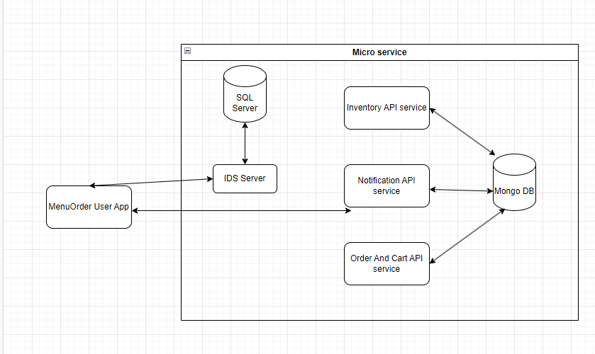
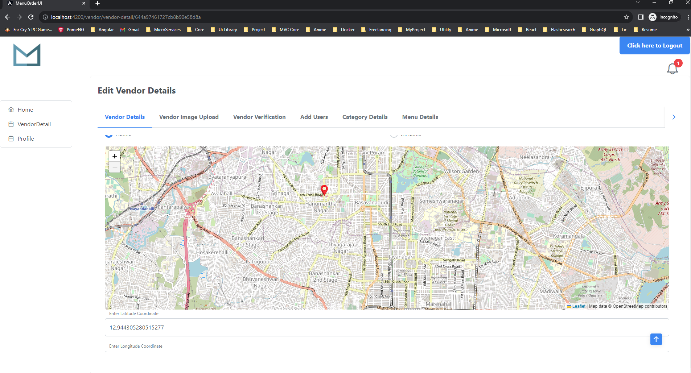
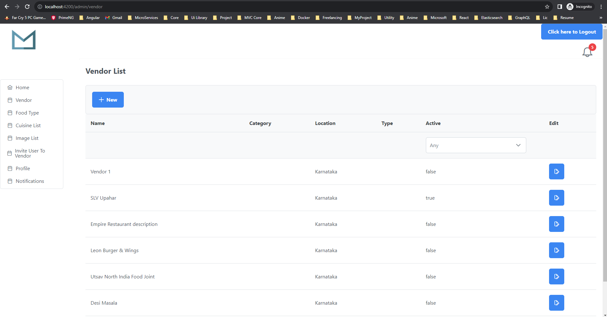
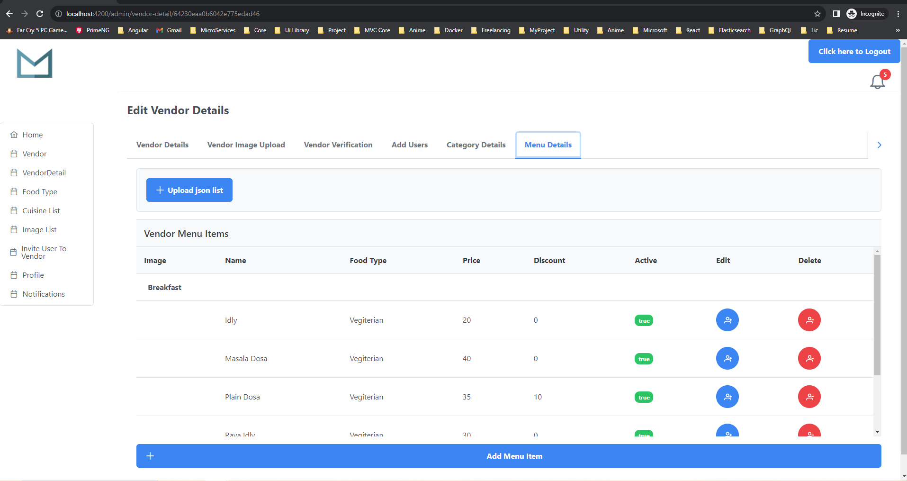
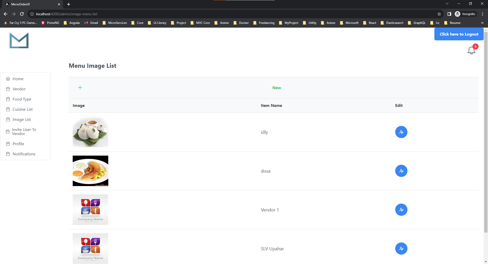
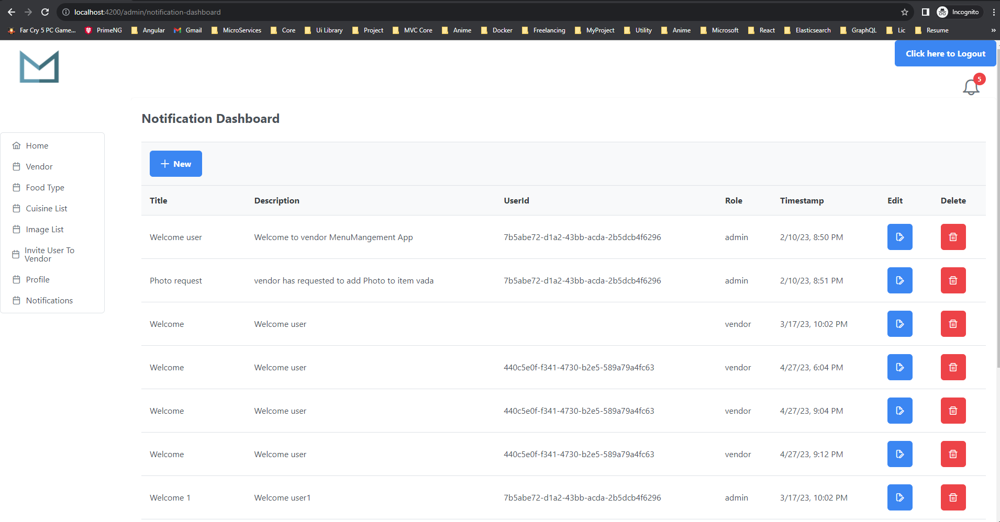
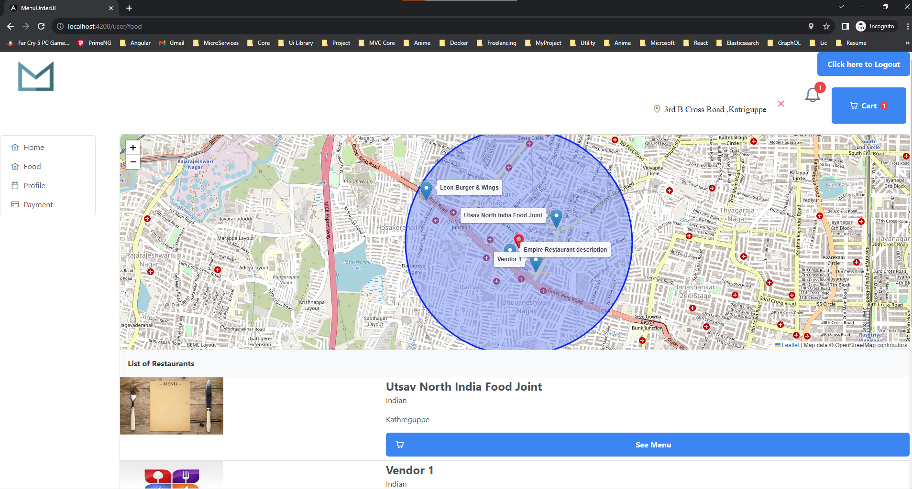
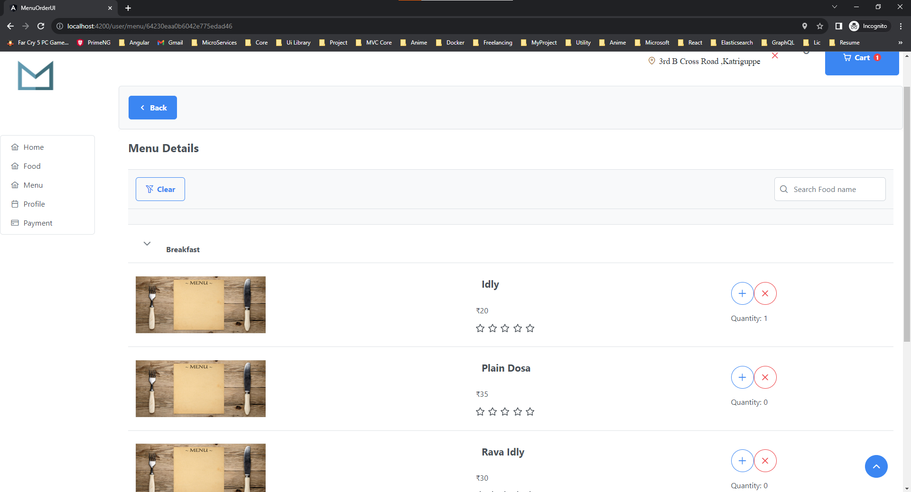
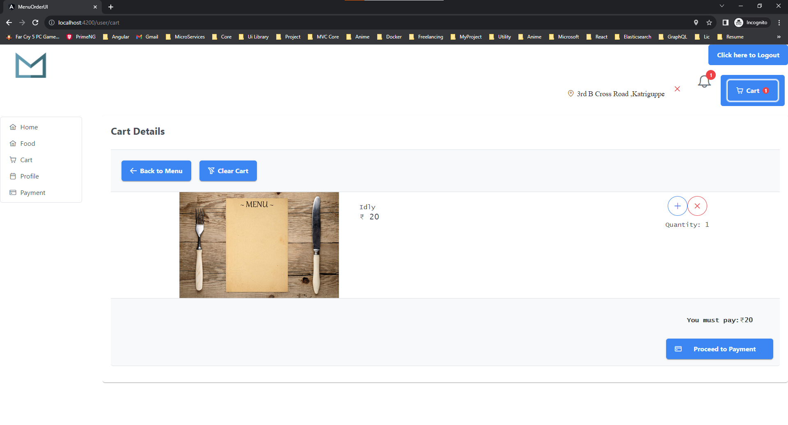
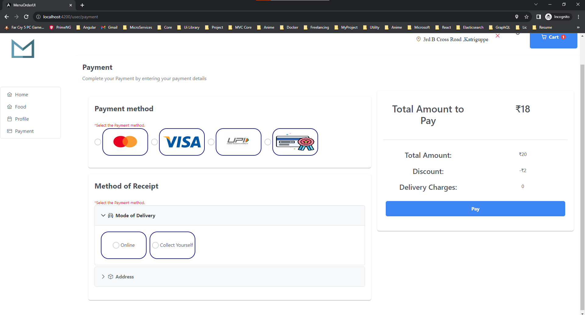

# OnlineFoodOrderManagement
Micro Service for Menu Order Management

This Application is used for ordering the menu and also customise the vendor details according to their need.

There are 3 roles User, Admin and Vendor.  
<b>User:</b> 
Here User will register to view the vendor menu and place items in cart based on the nearest location.
 
<b>Admin:</b> 
Here Admin will be able to edit any vendor details. Add Vendor Disable Vendor, add notiifcation.
 
<b>Vendor:</b> 
Here Vendor will register their shop in the application. Configure the Vendor menu based on thier needs.
 
<b>IDS Admin:</b> 
Here it is used for Microserive registration and token managemnt system. Angular UI will call the IDS server to get the Token and using
the  token we will call individual Microservice based on the access level. If the API is unable to access then we need to give necessary access level by
registering it as an Client ,API Resource and API Scope.

 
Code base: .Net Core 6 .Net Core MVC 6, SQL,MongoDB, Docker, IDs server is a mix of API and GraphQl.  

Front End: Angular 15 for UI.  
Front End: React Js for Identity server UI.  

Front end like Angular : https://github.com/shreyasudupas/MenuOrderAngular  
Front end ReactJs: https://github.com/shreyasudupas/react-menu-ids-ui  

<b><u>Overview of Application</u></b>  

Here we a single SignOn for all the Users (Admin,Vendor and User). The single SignOn is maagned by IdentityServer4 template. It has a separate admin portal which is designed using ReactJs

Here are some of the pics for Vendor, It shows the Vendor Details page where vendor can configure the menu, enter hotel location using the maps.

  

Here are some of the pics for Admin, Here Admin can configure vendor details, edit vendor location using maps, add/edit category, add/edit menu images, add/edit cuisine items, verify newly added vendor, add new notification.

<b>Admin Vendor List</b> 
  

<b>Admin Menu Page</b> 
  

<b>Admin Menu Item Image</b> 
  

<b>Admin Notification Dashboard</b> 
  

Here are some of the pics for Vendor, It shows the Vendor Details page where vendor can configure the menu, enter hotel location using the maps.

  

Here Users Page is used by end users to view their choice of restaurants, add menu to cart, make payments (right now only supports reward based transaction. 
 
<b>User Menu Page</b> 
  

<b>User Menu Page</b> 
  

<b>User Menu Page</b> 
  

<b>User Cart Page</b> 
  

<b>User Payment Page</b> 
  

 Reference for cache <a href="https://github.com/Xabaril/AspNetCore.Diagnostics.HealthChecks">HealthChecks</a>

 
 
<b>What is Circuit Breaker?</b>

Circuit Breaker is a design pattern, where you try a service call for a configured number of times. And if the service call 
fails consecutively for the configured number of times, you just open the circuit. This means the consecutive calls do not go
 to the service, rather immediately returned. And this continues to happen for a time duration configured.
  

 

 

