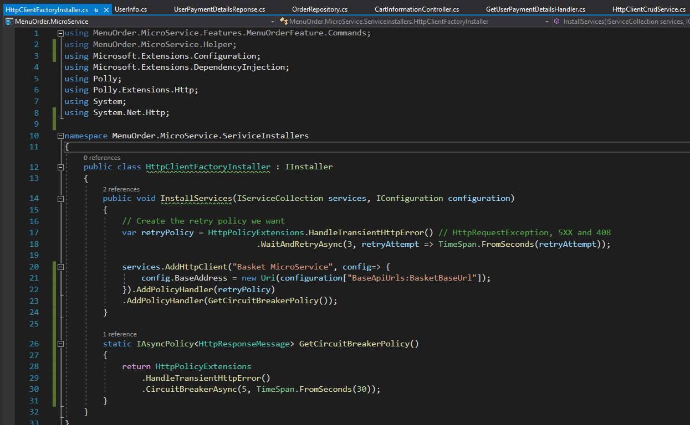
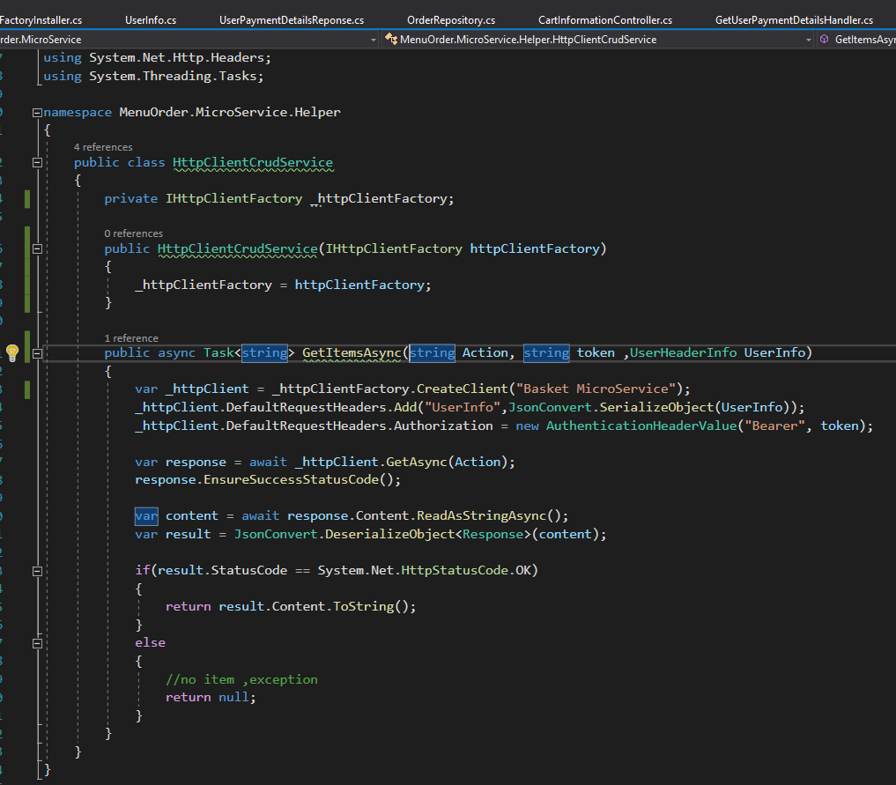

# OnlineFoodOrderManagement
Micro Service for Menu Order Management

This Application is used for ordering the menu and also customise the vendor details according to their need.

Code base: .Net Core 5, SQL, Redis,Mongo, Docker, EF Core 5, Background Service (.Net core), Ocelot Gateway.  

<b><u>Overview of Application</u></b>  

the user will login the application and then based of the request diffrent microservice.

<ul>
 <li> <b>Identity Micro Service</b>  User Authentication and getting user personal details. </li>
 <li> <b>Basket Service</b>  Redis cache is used for storing the cart information. </li>
 <li> <b>Menu Inventory MicroService</b>  Mongo DB is used to store custom vendor details and these details are handled in theis microservice.. </li>
 <li> <b>Order Microservice</b>  Used for ordering the user menu details. </li>
 <li> <b>Health Checks</b>  User Authentication and getting user personal details. </li>
 <li> <b>Identity Micro Service</b> Can check if the API, SQL, Redis Cache are in working conditons or not. </li>
 </ul>

 Reference for cache <a href="https://github.com/Xabaril/AspNetCore.Diagnostics.HealthChecks">HealthChecks</a>

 
 
<b>What is Circuit Breaker?</b>

Circuit Breaker is a design pattern, where you try a service call for a configured number of times. And if the service call 
fails consecutively for the configured number of times, you just open the circuit. This means the consecutive calls do not go
 to the service, rather immediately returned. And this continues to happen for a time duration configured.
  
 
 
 
In the Project <b>MenuOrder.MenuService</b> HttpClientFactoryInstaller File the HttpClient is registered with client name as shown in the diagram above.
 
  
 
  
 
Http client will call the named instance of httpClient i.e Basket MicroService and will try to call the url configured. If the 
 service is not up and running then circuit breaker comes into play and tries to call the API 5 times if success then result is 
 given or else it will not process and inform the user that server is busy.

